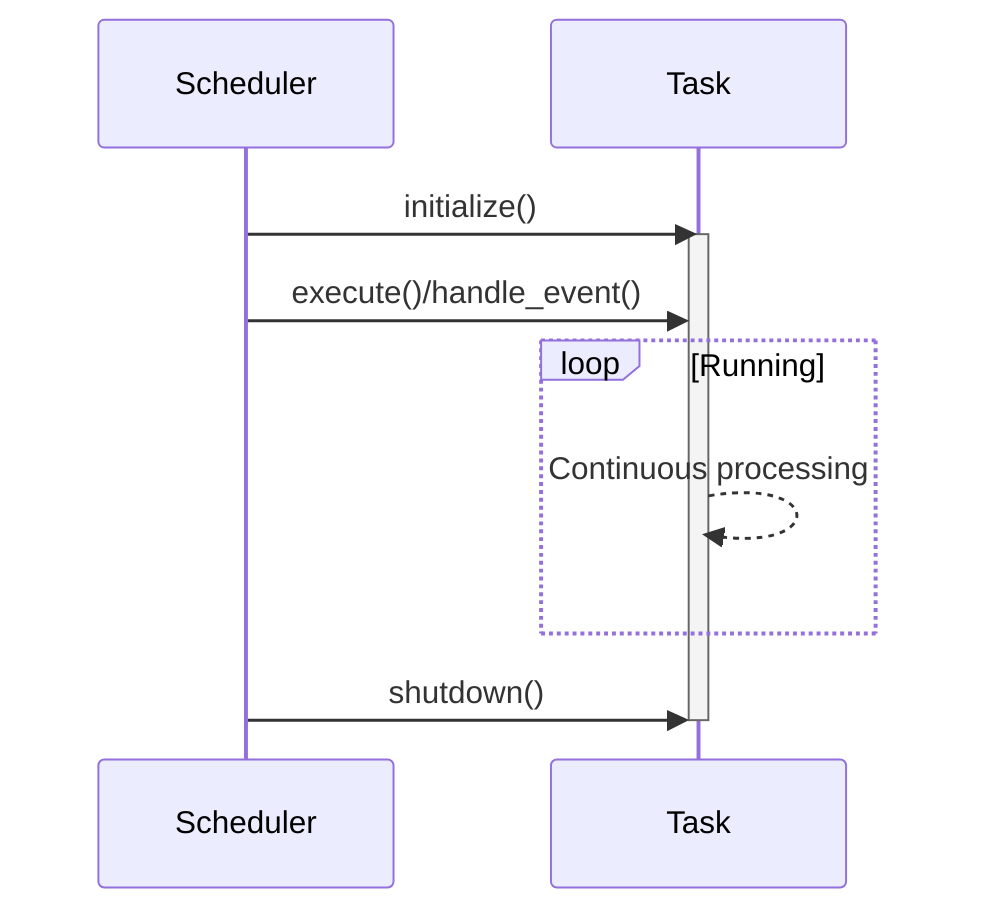

# Cryptocurrency Trading Engine Implementation Document

## Architecture Overview


The system consists of these core components:

```rust
Connector(N) → Aggregator(1) → Strategy(N) → Executor(N)
```

### Component Responsibilities

| Component       | Role                              | Implementation Requirements     |
|-----------------|-----------------------------------|----------------------------------|
| **Connector**   | Data acquisition from external sources | Implement `Connector` trait (multiple required) |
| **Aggregator**  | Data normalization and integration | Implement `Aggregator` trait (single required) |
| **Strategy**    | Market analysis and signal generation | Implement `Strategy` trait (multiple required) |
| **Executor**    | Order execution and risk management | Implement `Executor` trait (multiple required) |

## Core Traits

### Component Traits

```rust
#[async_trait]
pub trait Connector: BackgroundTask {}

#[async_trait]
pub trait Aggregator: BackgroundTask {}

#[async_trait]
pub trait Strategy<E: EventType + 'static>: EventTask<E> {}

#[async_trait]
pub trait Executor<E: EventType + 'static>: EventTask<E> {}
```

### Error Handling

```rust
#[derive(thiserror::Error, Debug)]
pub enum TradingEngineError {
    #[error("Scheduler Error: {0}")]
    SchedulerError(#[from] SchedulerError),
    #[error("Missing required component: {0}")]
    MissingComponent(&'static str),
}

// Runtime component validation:
- At least one Connector required
- Exactly one Aggregator required
- At least one Strategy required  
- At least one Executor required
```

## Event Flow Management

### Event Type Definition Example

```rust
#[derive(Debug, Clone, Hash, PartialEq, Eq)]
enum TradingEvent {
    MarketDataUpdate,
    TradeSignal,
    Shutdown,
}
```

### Event Bus Configuration

```rust
let event_bus = EventBus::new(vec![
    (TradingEvent::MarketDataUpdate, ChannelConfig {
        capacity: 1000,
        description: "Market data channel".to_string(),
    }),
    (TradingEvent::TradeSignal, ChannelConfig {
        capacity: 100,
        description: "Trade signals channel".to_string(),
    }),
    (TradingEvent::Shutdown, ChannelConfig {
        capacity: 10,
        description: "Shutdown channel".to_string(),
    }),
]);
```

## Task Scheduling System

### Scheduler Structure
```rust
pub struct Scheduler<E> {
    task_registry: TaskRegistry<E>,
    background_task_ids: Vec<TaskId>,
    event_task_ids: Vec<TaskId>,
    event_bus: EventBus<E>,
}

pub struct TaskRegistry<E> {
    background_tasks: HashMap<TaskId, Arc<Mutex<dyn BackgroundTask>>>,
    event_tasks: HashMap<TaskId, Arc<Mutex<dyn EventTask<E>>>>,
    next_task_id: TaskId,
}

pub struct EventBus<E> {
    channels: HashMap<E, broadcast::Sender<String>>,
    configs: Vec<ChannelConfig>,
}
```

### Scheduler Functionality
```rust
impl<E: EventType + 'static + ToString> Scheduler<E> {
    pub async fn start(&mut self) -> Result<(), SchedulerError> { /* Task startup logic */ }
    pub async fn shutdown(&mut self) -> Result<(), SchedulerError> { /* Task shutdown logic */ }
    pub fn register_background_task(&mut self, task: Arc<Mutex<dyn BackgroundTask>>) -> TaskId { /* Task registration */ }
    pub fn register_event_task(&mut self, task: Arc<Mutex<dyn EventTask<E>>>) -> TaskId { /* Event task registration */ }
}
```

### Task Registration Process

1. **Background Tasks** (Connector/Aggregator)
   ```rust
   scheduler.register_background_task(component)
   ```

2. **Event-driven Tasks** (Strategy/Executor)
   ```rust
   scheduler.register_event_task(component)
   ```

## Engine Lifecycle Management

```rust
// Component creation (wrapped in Arc<Mutex<T>>)
let connector = Arc::new(Mutex::new(MyConnector::new()));
let aggregator = Arc::new(Mutex::new(MyAggregator::new()));
let strategy = Arc::new(Mutex::new(MyStrategy::new()));
let executor = Arc::new(Mutex::new(MyExecutor::new()));

let mut engine = TradingEngineBuilder::new(event_bus)
    .with_connector(connector)
    .with_aggregator(aggregator)
    .with_strategy(strategy)
    .with_executor(executor)
    .build()?;

engine.start().await?;
// ... Runtime operations ...
engine.shutdown().await?;
```

## Task Lifecycle Management



## Extension Points and Implementation Examples

| Component Type | Implementation Requirements          |
|----------------|---------------------------------------|
| **Connector**  | Implement `async fn execute(&mut self)` (BackgroundTask trait) |
| **Aggregator** | Implement `async fn execute(&mut self)` (BackgroundTask trait) |
| **Strategy**   | Implement `async fn handle_event(&mut self, event: String)` (EventTask trait) |
| **Executor**   | Implement `async fn handle_event(&mut self, event: String)` (EventTask trait) |

// Trait implementation example (Connector)
#[async_trait]
impl Connector for MyConnector {
    async fn execute(&mut self) -> Result<(), TradingEngineError> {
        // Data fetching logic
        Ok(())
    }
}

// Trait implementation example (Strategy)
#[async_trait]
impl Strategy<TradingEvent> for MyStrategy {
    async fn handle_event(&mut self, event: String) -> Result<(), TradingEngineError> {
        // Event processing logic
        Ok(())
    }
}

### Background Task Implementation Details
```rust
#[async_trait]
pub trait BackgroundTask: Send + Sync {
    async fn execute(&mut self) -> Result<(), SchedulerError>;
}

#[async_trait]
impl BackgroundTask for MyConnector {
    async fn execute(&mut self) -> Result<(), SchedulerError> {
        // Data acquisition logic
        tokio::time::sleep(Duration::from_millis(500)).await;
        Ok(())
    }
}
```

### Event-driven Task Implementation Details
```rust
#[async_trait]
pub trait EventTask<E: EventType>: Send + Sync {
    fn subscribed_event(&self) -> &E;
    async fn handle_event(&mut self, event: String) -> Result<(), SchedulerError>;
}

#[async_trait]
impl EventTask<TradingEvent> for MyStrategy {
    fn subscribed_event(&self) -> &TradingEvent {
        &TradingEvent::MarketDataUpdate
    }

    async fn handle_event(&mut self, event: String) -> Result<(), SchedulerError> {
        // Event processing logic
        Ok(())
    }
}
```
