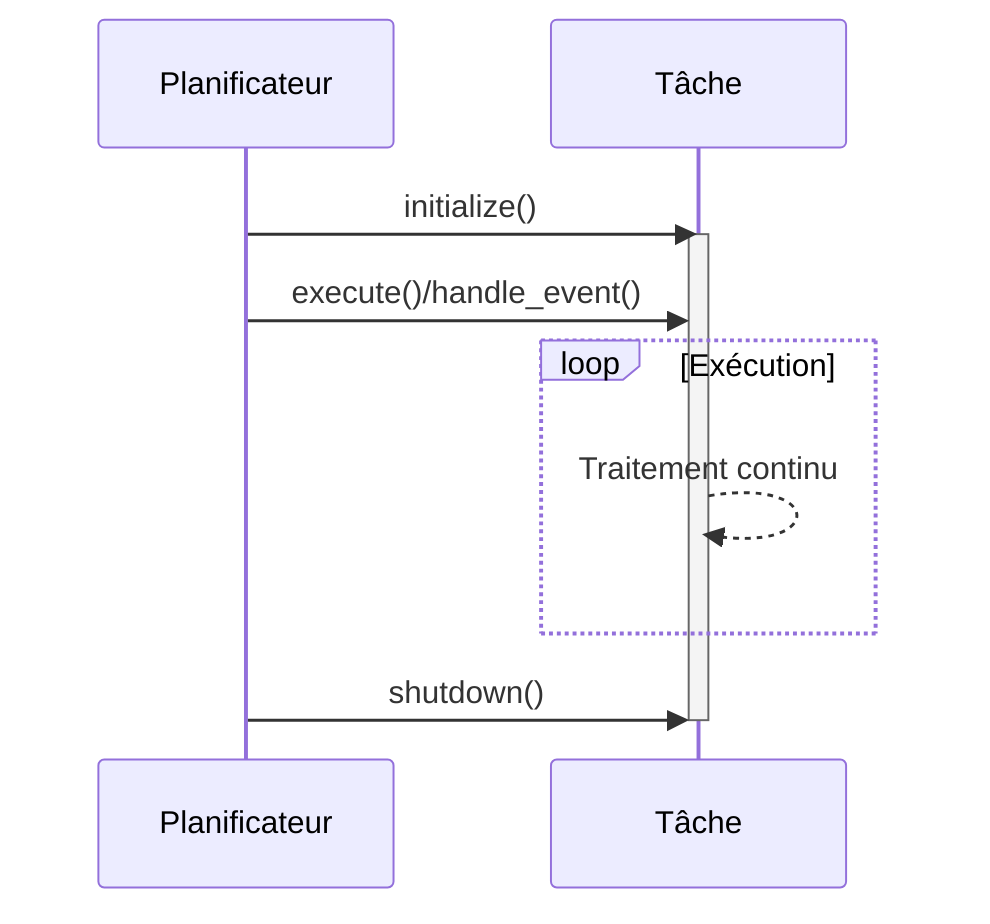

# Document d'Implémentation du Moteur de Trading Cryptographique

## Vue d'ensemble de l'architecture


Le système est composé des éléments principaux suivants :

```rust
Connector(N) → Aggregator(1) → Strategy(N) → Executor(N)
```

### Responsabilités des composants

| Composant       | Rôle                                  | Exigences d'implémentation      |
|-----------------|---------------------------------------|----------------------------------|
| **Connector**   | Acquisition de données externes       | Implémentation du trait `Connector` (multiple requis) |
| **Aggregator**  | Normalisation et intégration des données | Implémentation du trait `Aggregator` (un seul requis) |
| **Strategy**    | Analyse de marché et génération de signaux | Implémentation du trait `Strategy` (multiple requis) |
| **Executor**    | Exécution des ordres et gestion des risques | Implémentation du trait `Executor` (multiple requis) |

## Traits principaux

### Traits des composants

```rust
#[async_trait]
pub trait Connector: BackgroundTask {}

#[async_trait]
pub trait Aggregator: BackgroundTask {}

#[async_trait]
pub trait Strategy<E: EventType + 'static>: EventTask<E> {}

#[async_trait]
pub trait Executor<E: EventType + 'static>: EventTask<E> {}
```

### Gestion des erreurs

```rust
#[derive(thiserror::Error, Debug)]
pub enum TradingEngineError {
    #[error("Erreur du planificateur : {0}")]
    SchedulerError(#[from] SchedulerError),
    #[error("Composant requis manquant : {0}")]
    MissingComponent(&'static str),
}

// Validation à l'exécution :
- Au moins un Connector requis
- Exactement un Aggregator requis  
- Au moins un Strategy requis
- Au moins un Executor requis
```

## Gestion du flux d'événements

### Exemple de définition d'événement

```rust
#[derive(Debug, Clone, Hash, PartialEq, Eq)]
enum TradingEvent {
    MarketDataUpdate,
    TradeSignal,
    Shutdown,
}
```

### Configuration du bus d'événements

```rust
let event_bus = EventBus::new(vec![
    (TradingEvent::MarketDataUpdate, ChannelConfig {
        capacity: 1000,
        description: "Canal de données de marché".to_string(),
    }),
    (TradingEvent::TradeSignal, ChannelConfig {
        capacity: 100,
        description: "Canal de signaux de trading".to_string(),
    }),
    (TradingEvent::Shutdown, ChannelConfig {
        capacity: 10,
        description: "Canal d'arrêt".to_string(),
    }),
]);
```

## Système d'ordonnancement des tâches

### Structure du planificateur
```rust
pub struct Scheduler<E> {
    task_registry: TaskRegistry<E>,
    background_task_ids: Vec<TaskId>,
    event_task_ids: Vec<TaskId>,
    event_bus: EventBus<E>,
}

pub struct TaskRegistry<E> {
    background_tasks: HashMap<TaskId, Arc<Mutex<dyn BackgroundTask>>>,
    event_tasks: HashMap<TaskId, Arc<Mutex<dyn EventTask<E>>>>,
    next_task_id: TaskId,
}

pub struct EventBus<E> {
    channels: HashMap<E, broadcast::Sender<String>>,
    configs: Vec<ChannelConfig>,
}
```

### Fonctionnalités du planificateur
```rust
impl<E: EventType + 'static + ToString> Scheduler<E> {
    pub async fn start(&mut self) -> Result<(), SchedulerError> { /* Logique de démarrage */ }
    pub async fn shutdown(&mut self) -> Result<(), SchedulerError> { /* Logique d'arrêt */ }
    pub fn register_background_task(&mut self, task: Arc<Mutex<dyn BackgroundTask>>) -> TaskId { /* Enregistrement tâche */ }
    pub fn register_event_task(&mut self, task: Arc<Mutex<dyn EventTask<E>>>) -> TaskId { /* Enregistrement tâche événementielle */ }
}
```

### Processus d'enregistrement des tâches

1. **Tâches en arrière-plan** (Connector/Aggregator)
   ```rust
   scheduler.register_background_task(component)
   ```

2. **Tâches événementielles** (Strategy/Executor)
   ```rust
   scheduler.register_event_task(component)
   ```

## Gestion du cycle de vie du moteur

```rust
// Création des composants (encapsulés dans Arc<Mutex<T>>)
let connector = Arc::new(Mutex::new(MyConnector::new()));
let aggregator = Arc::new(Mutex::new(MyAggregator::new()));
let strategy = Arc::new(Mutex::new(MyStrategy::new()));
let executor = Arc::new(Mutex::new(MyExecutor::new()));

let mut engine = TradingEngineBuilder::new(event_bus)
    .with_connector(connector)
    .with_aggregator(aggregator)
    .with_strategy(strategy)
    .with_executor(executor)
    .build()?;

engine.start().await?;
// ... Opérations en cours d'exécution ...
engine.shutdown().await?;
```

## Gestion du cycle de vie des tâches



## Points d'extension et exemples d'implémentation

| Type de composant | Exigences d'implémentation          |
|-------------------|--------------------------------------|
| **Connector**     | Implémenter `async fn execute(&mut self)` (trait BackgroundTask) |
| **Aggregator**    | Implémenter `async fn execute(&mut self)` (trait BackgroundTask) |
| **Strategy**      | Implémenter `async fn handle_event(&mut self, event: String)` (trait EventTask) |
| **Executor**      | Implémenter `async fn handle_event(&mut self, event: String)` (trait EventTask) |

// Exemple d'implémentation de trait (Connector)
#[async_trait]
impl Connector for MyConnector {
    async fn execute(&mut self) -> Result<(), TradingEngineError> {
        // Logique de récupération des données
        Ok(())
    }
}

// Exemple d'implémentation de trait (Strategy)
#[async_trait]
impl Strategy<TradingEvent> for MyStrategy {
    async fn handle_event(&mut self, event: String) -> Result<(), TradingEngineError> {
        // Logique de traitement d'événement
        Ok(())
    }
}

### Détails d'implémentation des tâches en arrière-plan
```rust
#[async_trait]
pub trait BackgroundTask: Send + Sync {
    async fn execute(&mut self) -> Result<(), SchedulerError>;
}

#[async_trait]
impl BackgroundTask for MyConnector {
    async fn execute(&mut self) -> Result<(), SchedulerError> {
        // Logique d'acquisition de données
        tokio::time::sleep(Duration::from_millis(500)).await;
        Ok(())
    }
}
```

### Détails d'implémentation des tâches événementielles
```rust
#[async_trait]
pub trait EventTask<E: EventType>: Send + Sync {
    fn subscribed_event(&self) -> &E;
    async fn handle_event(&mut self, event: String) -> Result<(), SchedulerError>;
}

#[async_trait]
impl EventTask<TradingEvent> for MyStrategy {
    fn subscribed_event(&self) -> &TradingEvent {
        &TradingEvent::MarketDataUpdate
    }

    async fn handle_event(&mut self, event: String) -> Result<(), SchedulerError> {
        // Logique de traitement d'événement
        Ok(())
    }
}
```
