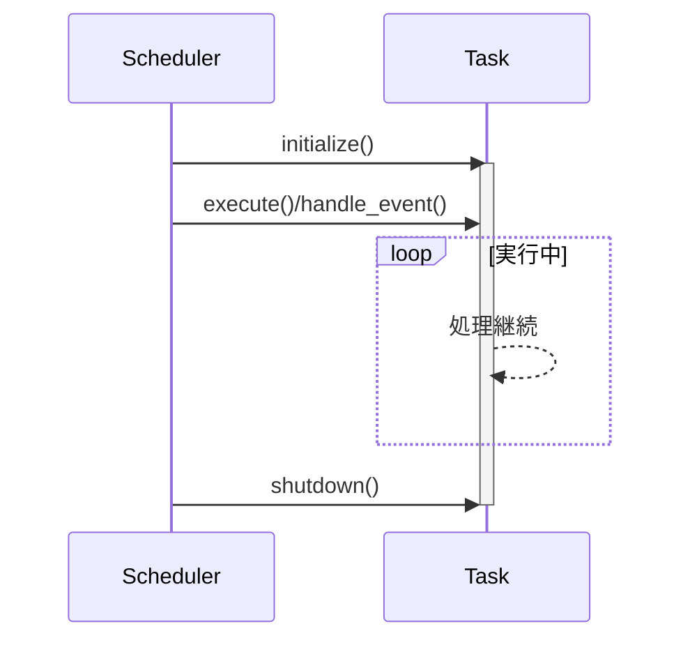

# 暗号通貨取引エンジン 実装ドキュメント

## アーキテクチャ概要


本システムは以下のコアコンポーネントで構成されます：

```rust
Connector(N) → Aggregator(1) → Strategy(N) → Executor(N)
```

### コンポーネント責任範囲

| コンポーネント   | 役割                             | 実装要件             |
|------------------|----------------------------------|----------------------|
| **Connector**    | 外部データソースからのデータ取得 | `Connector`トレイト実装（複数必須） |
| **Aggregator**   | データの正規化と統合             | `Aggregator`トレイト実装（単一必須） |
| **Strategy**     | 市場分析とシグナル生成           | `Strategy`トレイト実装（複数必須）  |
| **Executor**     | 注文執行とリスク管理             | `Executor`トレイト実装（複数必須）  |

## コアトレイト

### コンポーネントトレイト

```rust
#[async_trait]
pub trait Connector: BackgroundTask {}

#[async_trait]
pub trait Aggregator: BackgroundTask {}

#[async_trait]
pub trait Strategy<E: EventType + 'static>: EventTask<E> {}

#[async_trait]
pub trait Executor<E: EventType + 'static>: EventTask<E> {}
```

### エラー処理

```rust
#[derive(thiserror::Error, Debug)]
pub enum TradingEngineError {
    #[error("Scheduler Error: {0}")]
    SchedulerError(#[from] SchedulerError),
    #[error("必須コンポーネントが不足: {0}")]
    MissingComponent(&'static str),
}

// ビルド時の必須コンポーネントチェック
- 1つ以上のConnectorが必要
- 1つのAggregatorが必要
- 1つ以上のStrategyが必要
- 1つ以上のExecutorが必要
```

## イベントフロー管理

### イベントタイプ定義例

```rust
#[derive(Debug, Clone, Hash, PartialEq, Eq)]
enum TradingEvent {
    MarketDataUpdate,
    TradeSignal,
    Shutdown,
}
```

### イベントバス設定

```rust
let event_bus = EventBus::new(vec![
    (TradingEvent::MarketDataUpdate, ChannelConfig {
        capacity: 1000,
        description: "Market data channel".to_string(),
    }),
    (TradingEvent::TradeSignal, ChannelConfig {
        capacity: 100,
        description: "Trade signals channel".to_string(),
    }),
    (TradingEvent::Shutdown, ChannelConfig {
        capacity: 10,
        description: "Shutdown channel".to_string(),
    }),
]);
```

## タスクスケジューリングシステム

### スケジューラ構造体
```rust
pub struct Scheduler<E> {
    task_registry: TaskRegistry<E>,
    background_task_ids: Vec<TaskId>,
    event_task_ids: Vec<TaskId>,
    event_bus: EventBus<E>,
}

pub struct TaskRegistry<E> {
    background_tasks: HashMap<TaskId, Arc<Mutex<dyn BackgroundTask>>>,
    event_tasks: HashMap<TaskId, Arc<Mutex<dyn EventTask<E>>>>,
    next_task_id: TaskId,
}

pub struct EventBus<E> {
    channels: HashMap<E, broadcast::Sender<String>>,
    configs: Vec<ChannelConfig>,
}
```

### スケジューラ機能
```rust
impl<E: EventType + 'static + ToString> Scheduler<E> {
    pub async fn start(&mut self) -> Result<(), SchedulerError> { /* 全タスクの起動処理 */ }
    pub async fn shutdown(&mut self) -> Result<(), SchedulerError> { /* 全タスクの停止処理 */ }
    pub fn register_background_task(&mut self, task: Arc<Mutex<dyn BackgroundTask>>) -> TaskId { /* タスク登録 */ }
    pub fn register_event_task(&mut self, task: Arc<Mutex<dyn EventTask<E>>>) -> TaskId { /* イベントタスク登録 */ }
}
```

### タスク登録プロセス

1. **バックグラウンドタスク**（Connector/Aggregator）
   ```rust
   scheduler.register_background_task(component)
   ```

2. **イベント駆動タスク**（Strategy/Executor）
   ```rust
   scheduler.register_event_task(component)
   ```

## エンジンライフサイクル管理

```rust
// コンポーネントの作成（Arc<Mutex<T>>でラップ）
let connector = Arc::new(Mutex::new(MyConnector::new()));
let aggregator = Arc::new(Mutex::new(MyAggregator::new()));
let strategy = Arc::new(Mutex::new(MyStrategy::new()));
let executor = Arc::new(Mutex::new(MyExecutor::new()));

let mut engine = TradingEngineBuilder::new(event_bus)
    .with_connector(connector)
    .with_aggregator(aggregator)
    .with_strategy(strategy)
    .with_executor(executor)
    .build()?;

engine.start().await?;
// ... 実行処理 ...
engine.shutdown().await?;
```

## タスクライフサイクル管理



## 拡張ポイントと実装例

| コンポーネントタイプ | 実装要件                          |
|----------------------|-----------------------------------|
| **Connector**         | `async fn execute(&mut self)`を実装（BackgroundTaskトレイト） |
| **Aggregator**        | `async fn execute(&mut self)`を実装（BackgroundTaskトレイト） |
| **Strategy**          | `async fn handle_event(&mut self, event: String)`を実装（EventTaskトレイト） |
| **Executor**          | `async fn handle_event(&mut self, event: String)`を実装（EventTaskトレイト） |

// トレイト実装例（Connector）
#[async_trait]
impl Connector for MyConnector {
    async fn execute(&mut self) -> Result<(), TradingEngineError> {
        // データ取得処理
        Ok(())
    }
}

// トレイト実装例（Strategy）
#[async_trait]
impl Strategy<TradingEvent> for MyStrategy {
    async fn handle_event(&mut self, event: String) -> Result<(), TradingEngineError> {
        // イベント処理
        Ok(())
    }
}

### バックグラウンドタスク実装詳細
```rust
#[async_trait]
pub trait BackgroundTask: Send + Sync {
    async fn execute(&mut self) -> Result<(), SchedulerError>;
}

#[async_trait]
impl BackgroundTask for MyConnector {
    async fn execute(&mut self) -> Result<(), SchedulerError> {
        // データ取得ロジック
        tokio::time::sleep(Duration::from_millis(500)).await;
        Ok(())
    }
}
```

### イベント駆動タスク実装詳細
```rust
#[async_trait]
pub trait EventTask<E: EventType>: Send + Sync {
    fn subscribed_event(&self) -> &E;
    async fn handle_event(&mut self, event: String) -> Result<(), SchedulerError>;
}

#[async_trait]
impl EventTask<TradingEvent> for MyStrategy {
    fn subscribed_event(&self) -> &TradingEvent {
        &TradingEvent::MarketDataUpdate
    }

    async fn handle_event(&mut self, event: String) -> Result<(), SchedulerError> {
        // イベント処理ロジック
        Ok(())
    }
}
```
